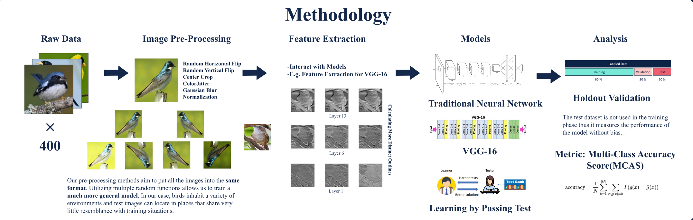

# Bird Spieces Classification: A Study of Sizebale Classes Image Classification

## Team Members
- Jiawei Zheng
- Xiangchen Zhao
- Yilin Bao

## Requirements

- python 3.9
- pandas 1.4.2
- pytorch 1.1
- cuda 1.11
- torchvision 0.12.0
- opencv-python 4.6
- matplotlib 3.5.2
- seaborn 0.11.2

## Loading the Data
The data is located on https://drive.google.com/file/d/1kQj60prgIMC-nuPAESheyOuBbRuJmtFf/view?usp=sharing in a packaged format.
Download the files and put them in the root directory under /data. The file and folders that are going to be used are class_dict, train, test, and valid.
## Folder Structure
-EfficientNet
-LPT
-VGG16

## Reproducing Procedure
For example, the workflow for Efficient Net is to download the data, redirect to the EfficientNet directory, and run `python3 model.py`
The output of the Efficient Net is the model which can be saved as pickle format. The train_list and valid_list that is pass in to the trian function contains the loss and accuracy value.
